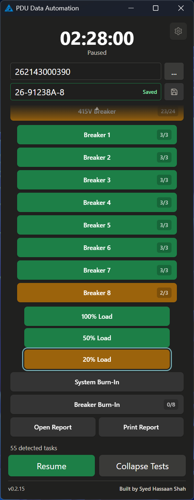
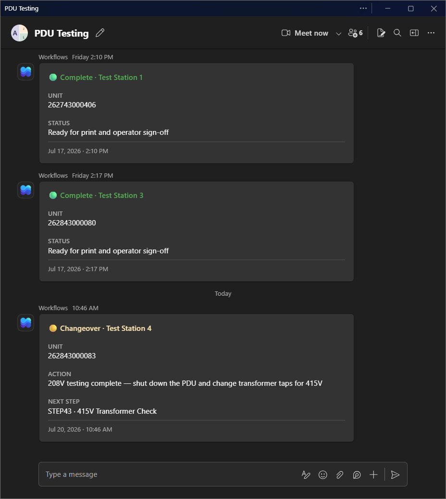

<div align="center">

# Data Automation App

</div>

<table>
<tr>
<td width="52%" valign="middle">

**Test-floor automation for PDU stations** — CSVs in, Excel reports out, Teams in the loop.

Windows desktop app for production test stations. Operators pick a unit folder; the app watches instrument CSVs, tracks every step on a familiar panel, validates readings, and writes the Excel test report without hand-editing spreadsheets.

It is the pilot replacement for the legacy Python automation scripts. Same workflow operators already know — unit selection, large countdown, 208V / 415V sections, expandable breakers, burn-in, manual rerun, Open Report, and Print Report — with a cleaner stack underneath (Tauri 2, React, Rust), data-driven report mappings, and signed in-app updates from GitHub Releases.

Built for the real floor: wait for instrument files to finish writing, never turn missing values into silent zeros, preserve out-of-range readings in Excel while flagging the failed step, and keep workbook formatting and formulas intact.

**What operators get**

- STEP CSV detection with readiness waiting (no half-written scrapes)
- Accuracy validation before any report write
- Color-coded task states, mid-test resume, and remaining-time countdown
- Transformer SN save, Open Report, and Print Report with operator sign-off
- Optional Teams **Complete**, **Problem**, and **Changeover** cards across stations
- Current-user Windows installer + signed updater path

**[Download v0.2.17 →](https://github.com/Hassaan-ECE/PDU_Data_Automation_App/releases/tag/v0.2.17)** · [All releases](https://github.com/Hassaan-ECE/PDU_Data_Automation_App/releases)

</td>
<td width="48%" valign="middle" align="center">

<!-- Width tuned so the tall panel roughly matches the left-column text height on GitHub -->


</td>
</tr>
</table>

## Download

Get the current pilot installer from the [latest GitHub release](https://github.com/Hassaan-ECE/PDU_Data_Automation_App/releases/latest), or use the S-drive package your site already stages for operators.

| | |
| --- | --- |
| **Current release** | [v0.2.17](https://github.com/Hassaan-ECE/PDU_Data_Automation_App/releases/tag/v0.2.17) |
| **Platform** | Windows · current-user NSIS installer |
| **Updates** | Signed in-app updater (after the first install from the matching key era) |

The app can check for updates when the station is ready. Keep the legacy tool available until your team has run several production units side by side.

## Get started

1. Install the setup EXE and open **PDU Data Automation**.
2. Browse to the unit’s data folder.
3. Confirm / save the Transformer SN, then **Start** or **Resume**.
4. Let the panel follow the active step — green for pass, amber for in progress, expandable breakers for load steps.
5. When the unit is done, use **Open Report** or **Print Report** (final operator name, then Excel’s print UI).

For multi-PC Teams and floor identity settings, point every station at the **same** shared `.PDU_Notifications` folder. Do not hard-code different paths per machine.

## Teams on the floor

Stations post Adaptive Cards into a shared Microsoft Teams channel so the floor sees **Complete**, **Problem**, and **Changeover** events without walking the aisle — for example when 208V work is finished and the unit needs to shut down and retap for 415V.

Setup is password-gated in Advanced Settings. Every PC on the floor should browse to the same shared `.PDU_Notifications` folder.

<p align="center">
  
</p>

Details: [docs/NOTIFICATIONS.md](docs/NOTIFICATIONS.md)

## How it works

1. **Detect** STEP-numbered CSVs from the instruments  
2. **Wait** until files are stable and ready to read  
3. **Patch** valid and out-of-range readings into the Excel workbook
4. **Validate** accuracy and visibly flag failed steps without stopping the sequence
5. **Track** remaining time, section status, and breaker progress on the panel  

Missing values never become silent zeros. Out-of-range values remain visible in the report and are marked failed in the app. Report cell maps prefer config under `config/report-layouts/` over hardcoding in source.

## Develop

```powershell
bun install
bun run desktop          # real Tauri app with live CSV/Excel processing
bun run desktop:demo     # accelerated floor demo; no CSV/Excel files changed
bun run dev:frontend     # UI only
bun run test
bun run lint
bun run validate         # full local check before a release
```

The floor demo auto-loads a synthetic unit, starts the sequence, and intentionally fails an early accuracy step in red while continuing to the next test. Release builds and `bun run desktop` never enable simulation mode.

```powershell
cargo test --manifest-path backend\Cargo.toml
```

| Path | Role |
| --- | --- |
| `backend/` | Tauri + Rust (scan, CSV, reports, notifications) |
| `frontend/` | React operator UI |
| `config/report-layouts/` | Excel / CSV mappings |
| `docs/` | Architecture, legacy notes, release process |
| `fixtures/` | Synthetic test data |
| `release/` | Per-version release notes |

## Learn more

- [Overview](docs/OVERVIEW.md) — status and remaining pilot work  
- [Architecture](docs/ARCHITECTURE.md) — runtime shape and data flow  
- [Legacy behavior](docs/LEGACY_BEHAVIOR.md) — what to preserve or correct  
- [Configuration model](docs/CONFIGURATION_MODEL.md) — report layout profiles  
- [Release & deployment](docs/RELEASE_AND_DEPLOYMENT.md) — signing, GitHub, S-drive  
- [Notifications](docs/NOTIFICATIONS.md) — Teams and floor settings  
- [Release notes](release/) — version-by-version history  

## Status

**Production pilot.** Core workflow, report writing, installer, and updater path are in use on the floor. Full cutover waits on more report comparisons against the legacy pipeline and broader station rollout.

Built by Syed Hassaan Shah.

## License

This project is open source under the [MIT License](LICENSE).

```
Copyright (c) 2026 Syed Hassaan Shah
```

You are free to use, modify, and distribute the software, including commercially, provided the copyright and license notice are included.
