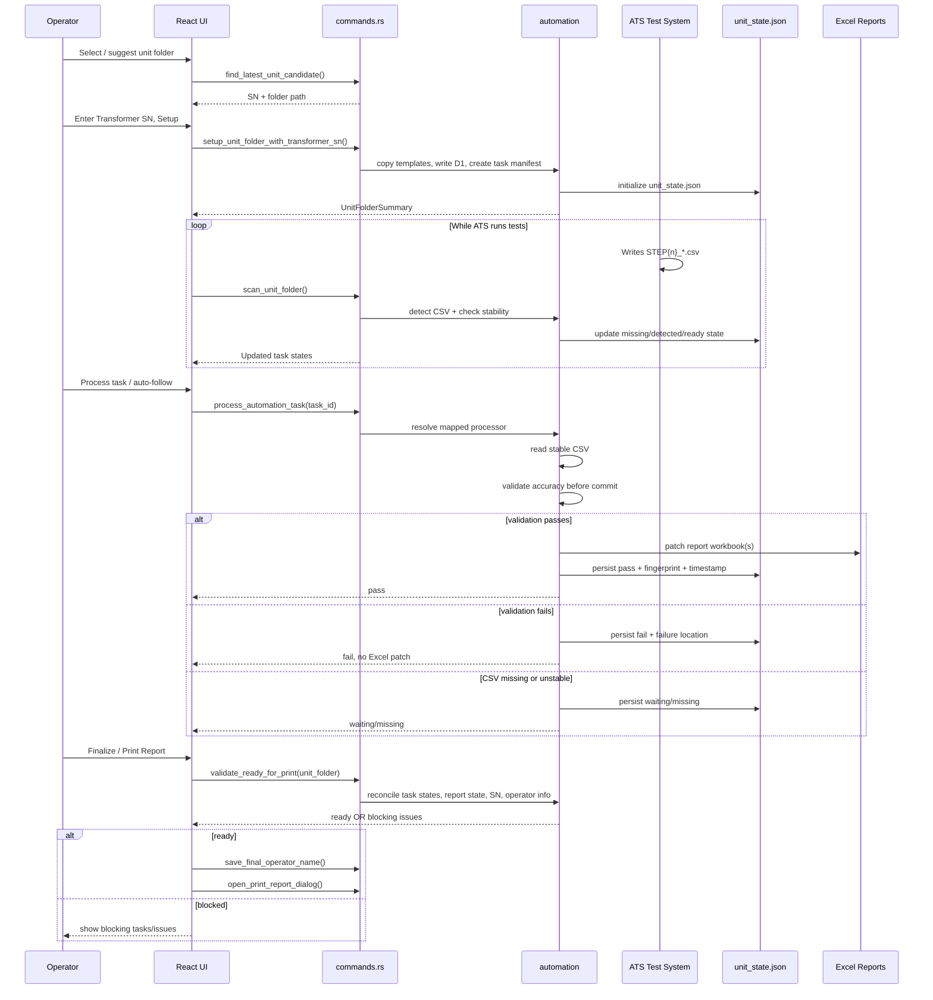

# PDU Data Automation Backend – Logic Audit & Fix Roadmap

**Date:** June 23, 2026  
**App:** Tauri 2 Desktop Application (Rust backend + React frontend)  
**Purpose:** Systematic identification and remediation of weak logic that can lead to incorrect reports, data loss, lost state, or unsafe operator actions.

---

## Executive Summary

The current backend contains several high-severity logic issues that affect **report integrity**, **restart resilience**, and **operator safety**. While the application is functional and has good architectural foundations (dual processing paths, ZIP/XML Excel patching, clear task model), it lacks critical safeguards around:

- Writing data to reports before verification passes
- Allowing print/sign-off on incomplete or failed runs
- Reading files while the ATS is still writing them
- Losing all task processing history on restart

This document consolidates findings from a structured code audit and defines a phased remediation plan.

---

## Core Principles

These principles should guide all future changes to the automation logic:

1. **Validate First, Commit Second**  
   Never write to Excel reports until validation (schema, values, tolerances, expected step) has passed.  
   Failed verification must **not** result in patched data by default.

2. **Never Print Without Reconciliation**  
   `save_final_operator_name()` and `open_print_report_dialog()` must be gated behind a backend check that confirms the run is complete or all exceptions were explicitly accepted.

3. **Stabilize Before Reading**  
   Do not read a CSV file until its size and modified time have been stable for a short window. Partial files from the ATS must be treated as `waiting`, not processed.

4. **Persist Task State**  
   Task outcomes (`pass`/`fail`/`waiting`/`accepted`) must survive app restart via a `unit_state.json` sidecar. The UI must never be the only source of truth.

5. **Make Processing Idempotent**  
   Re-running a task with the same CSV fingerprint must be safe and auditable. Double-patching or silent overwrites are not acceptable.

---

## Risk Summary Table

| Rank | Issue | Severity | Primary Risk | Phase |
|------|-------|----------|--------------|-------|
| 1 | Verification failure still patches Excel | **Critical** | Bad data enters official report | 1 |
| 2 | No reconciliation gate before printing | **Critical** | Operator can sign off on incomplete/failed data | 1 |
| 3 | No CSV stability detection before processing | High | Partial/incomplete CSVs are processed | 1 |
| 4 | No persistent task processing ledger | High | State lost on restart; no audit trail | 2 |
| 5 | Risky Excel replace pattern (delete → rename) | High | Data loss on crash or concurrent write | 3 |
| 6 | Partial commits on multi-workbook tasks | High | Inconsistent main vs print reports | 3 |
| 7 | `build_summary` is expensive + detection ≠ processable | Medium | Performance + misleading UI state | 2 |
| 8 | Error code conflation (`waiting` vs `missing` vs `fail`) | Medium | Poor reconciliation and operator guidance | 2 |

---

## Phased Fix Roadmap

### Phase 1: Protect Report Integrity (Highest Priority)

**Goal:** Prevent incorrect or incomplete data from entering reports and being signed off.

**Tasks:**

- [x] **1.1** Never patch Excel on verification failure (unless operator explicitly overrides)
  - Refactor `processors.rs` and `mapped.rs` to separate **validate** and **commit** steps
  - Only call `patch_workbook()` after accuracy checks pass or after explicit acceptance

- [x] **1.2** Add backend `validate_ready_for_print(unit_folder)` function
  - Check: all required tasks are `pass` or explicitly accepted
  - Check: Transformer SN is saved
  - Check: No unhandled `fail` / `waiting` states
  - Return structured list of blocking issues

- [x] **1.3** Gate `save_final_operator_name()` and `open_print_report_dialog()` behind the validation above
  - Return clear error codes + list of problematic tasks when blocked

- [x] **1.4** Update frontend (`OperatorPanel.tsx`) to respect new backend validation errors

- [x] **1.5** Add basic CSV stability check inside `process_automation_task` and processors
  - Implement lightweight `wait_for_stable_csv()` (size + mtime unchanged over short window)
  - Treat unstable files as `waiting` instead of attempting to process them

**Expected Outcome:** It becomes impossible to write bad verification results or print an incomplete run without explicit operator override + audit trail. Partial ATS files are no longer processed by accident.

---

### Phase 2: Add Durability & Idempotency

**Goal:** Make task state survive restarts and make re-processing safe and auditable.

**Tasks:**

- [x] **2.1** Design and implement `unit_state.json` sidecar inside each unit folder
  - Per-task fields: `task_id`, `state`, `code`, `source_csv_path`, `csv_fingerprint`, `processed_at`, `result`, `accepted` (bool + metadata), `audit_log[]`

- [x] **2.2** Modify `build_summary()` and `scan_unit_folder()` to merge filesystem detection with persisted ledger

- [x] **2.3** Add fingerprint-based idempotency guard in `process_task()`
  - If same CSV fingerprint was already successfully processed → short-circuit or warn

- [x] **2.4** Ensure every `process_task()` call writes result + fingerprint + timestamp to the sidecar (success or failure)

- [x] **2.5** Update `build_summary()` to also surface `processable: bool` and `match_reason` per task

**Expected Outcome:** Operators can restart the app and resume work. Re-running tasks becomes safe and auditable.

---

### Phase 3: Harden File Handling & Stability

**Goal:** Eliminate race conditions with the ATS and make Excel patching robust.

**Tasks:**

- [x] **3.1** Implement `wait_for_stable_csv(path, stable_ms, max_wait)` in `csv_data.rs`
  - Check that size + mtime are unchanged over N consecutive polls before allowing read

- [x] **3.2** Call stability wait from `require_csv()` / `require_csv_by_pattern()` before any `CsvTable::read()`

- [x] **3.3** Improve `patch_workbook()` safety:
  - Use atomic replace with backup (`.bak`)
  - Add per-workbook advisory locking
  - Make multi-workbook updates transactional (all-or-nothing with rollback)
  - 2026-06-24 implementation note: workbook writes now use a per-workbook lock file, `.bak` backup, and rollback for multi-workbook commits. Windows replacement is backup-backed and rollback-safe; a lower-level OS atomic replace API can still be considered later if needed.

- [x] **3.4** Distinguish error codes more clearly:
  - `2` = waiting (transient / still writing)
  - `3` = missing CSV
  - `1` = hard failure / verification failure

- [ ] **3.5** Add optional minimum row count / expected fragment validation for known STEP types

**Expected Outcome:** Much lower chance of processing partial files or losing data during patching.

---

## Updated Recommended Sequence Diagram

This is the safer logical flow that incorporates **Validate First, Commit Second** and the required reconciliation gate:

**Key improvements over the original sequence:**
- Stability check happens during monitoring and before processing
- Clear branching: **validate first**, only patch on success
- `unit_state.json` is updated at every meaningful step
- `validate_ready_for_print()` gate before any finalization/printing

---

## Detailed Findings

### Tier 1 Findings

#### 1. Verification Failure Still Writes to Excel (Critical)

**Location:**  
- `backend/src/automation/processors.rs` (lines ~252–254, ~328)  
- `backend/src/automation/mod.rs` → `process_task()`

**Current Behavior:**  
Accuracy verification runs *after* `patch_workbook()` is called in several processors (`process_system`, `process_breaker`).

**Risk:**  
Out-of-tolerance values are permanently written into the report even when the task returns `state: "fail"`. The operator can still print the report.

**Fix Direction:**  
Split validation and commit. Only patch after verification passes (or after explicit override with audit entry).

---

#### 2. No Reconciliation Gate Before Printing (Critical)

**Location:**  
- `backend/src/automation/mod.rs` → `save_final_operator_name()`, `open_print_report_dialog()`  
- `backend/src/commands.rs`

**Current Behavior:**  
Only checks folder existence, report presence, and non-blank operator name. No check on task completion state.

**Risk:**  
Operator can formally sign off on a report that still contains template defaults or failed verification values.

**Fix Direction:**  
Add `validate_ready_for_print()` and gate both commands behind it.

---

#### 3. No CSV Stability Detection Before Processing (High)

**Location:**  
- `backend/src/automation/csv_data.rs` → `find_latest_csv()`, `CsvTable::read()`  
- `backend/src/automation/mod.rs` → `build_summary()`

**Current Behavior:**  
Newest file by `modified` time is selected and read immediately. Only Windows sharing violation (error 32/33) is treated as transient.

**Risk:**  
ATS may still be writing the CSV. First byte may be readable while the file is incomplete → partial data parsed as valid.

**Fix Direction:**  
Add `wait_for_stable_csv()` with size + mtime stability window. Treat unstable files as `waiting`.

---

#### 4. No Persistent Task Processing Ledger (High)

**Location:**  
- Entire `automation/` layer — all state is derived from live CSV scan

**Current Behavior:**  
`build_summary()` only returns `"off"` or `"detected"`. Processed results (`pass`/`fail`) exist only in memory and in the Excel file.

**Risk:**  
After restart, the UI cannot show which tasks were accepted, failed, or skipped. Reconciliation becomes guesswork.

**Fix Direction:**  
Introduce `unit_state.json` sidecar + merge logic on every scan.

---

### Tier 2 Findings

#### 5. Risky Excel Replace Pattern + Lack of Locking (High)

**Location:**  
- `backend/src/automation/reports.rs` → `patch_workbook()`, `rewrite_workbook()`

**Current Behavior:**  
Read ZIP → modify in memory → write `.xlsx.tmp` → delete original → rename.

**Risk:**  
- TOCTOU race with Excel or ATS  
- Crash between delete and rename = data loss  
- No protection against concurrent writers

**Fix Direction:**  
Use safer atomic replace + backup + per-workbook locking. Make multi-workbook tasks transactional.

---

#### 6. Partial Commits on Multi-Workbook Tasks (High)

**Location:**  
- `backend/src/automation/processors.rs` (e.g. lines 412–413)

**Current Behavior:**  
Some tasks patch main report first, then print report. Failure on second patch leaves inconsistent state.

**Risk:**  
Main report updated with values that never made it to the print report.

**Fix Direction:**  
Wrap multi-workbook updates in a single commit unit with rollback capability.

---

#### 7. `build_summary` Performance + Detection vs Processable Gap (Medium)

**Location:**  
- `backend/src/automation/mod.rs` → `build_summary()`, `detected_steps()`

**Current Behavior:**  
Full `WalkDir` + 65 task allocation on every scan. Detection only checks `_STEP{n}_` pattern; processing requires additional filename fragments.

**Risk:**  
- Expensive on frequent polling  
- UI can show “detected” for tasks that cannot actually be processed

**Fix Direction:**  
Add caching/incremental scan. Return `processable` flag + reason per task.

---

#### 8. Error Code Conflation (Medium)

**Current Behavior:**  
Code `2` is used for both “CSV still locked (waiting)” and “CSV missing”.

**Risk:**  
Reconciliation logic and operators cannot distinguish between “retry later” and “needs attention”.

**Fix Direction:**  
Use distinct codes and surface them clearly in `TaskProcessResult`.

---

## Open Questions & Future Considerations

- Should verification failure **ever** write measured values to the report (even with override), or should it only write on explicit acceptance?
- Do we want a full audit log file in addition to the `unit_state.json` sidecar?
- Should the monitor eventually become event-driven (`folder_monitor.rs`) instead of UI polling?
- How should we handle legacy unit folders that have no `unit_state.json` yet?

---

## How to Use This Document

1. Start with **Phase 1** tasks — they give the biggest safety improvement.
2. Move to **Phase 2** for restart resilience and auditability.
3. Finish with **Phase 3** for robustness against ATS timing.
4. Update checkboxes and add notes as fixes are implemented.
5. Re-audit after major changes.

---

**Recommended Implementation Order (Refined)**

1. **Fix validation-before-commit** (Phase 1.1)  
   This is the single most important logic change. Never patch Excel when verification fails.

2. **Add `validate_ready_for_print()` gate** (Phase 1.2 + 1.3)  
   Do not allow `save_final_operator_name()` or `open_print_report_dialog()` to run without passing reconciliation checks.

3. **Add `unit_state.json` sidecar** (Phase 2)  
   This enables restart recovery, proper reconciliation, and idempotent reprocessing.

4. **Add basic CSV stability check** (Phase 1.5)  
   Even a simple size + mtime stability window inside `process_automation_task` significantly reduces the chance of processing partial ATS files.

5. **Harden Excel patching + full stability function** (Phase 3)  
   Atomic replace, locking, and the more robust `wait_for_stable_csv()` can come after the integrity guarantees are in place.

A simple periodic scan from the UI remains acceptable in the short term, as long as the backend enforces stability, validation-before-commit, persistent state, and the print gate.

---

*Document updated June 23, 2026 – Refined with Validate-First-Commit principle and updated sequence*
